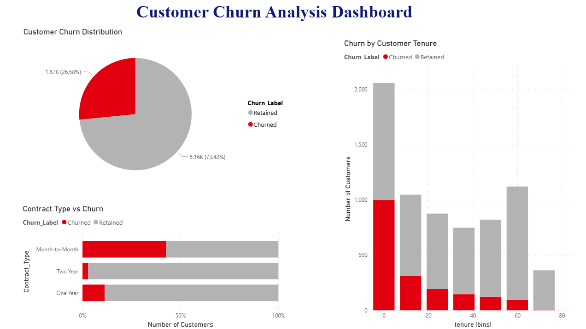

# 📊 Customer Churn Analysis & Prediction

## 🚀 Project Overview
This project analyzes customer churn behavior and builds a predictive model using machine learning and visualization.

## 🔍 Key Features
- Exploratory Data Analysis (EDA)
- Hypothesis Testing (Chi-square, t-test)
- Logistic Regression Model (ROC-AUC: 0.83)
- Feature Engineering & Encoding
- Power BI Dashboard

## 📈 Key Insights
- Low tenure customers are more likely to churn
- Month-to-month contracts have highest churn
- Long-term contracts reduce churn significantly

## 🛠 Tools Used
- Python (Pandas, Scikit-learn)
- Power BI
- Jupyter Notebook

## 📂 Files
- churn_analysis.ipynb → Full analysis
- churn_cleaned_data.csv → Cleaned dataset
- Customer_Churn_Dashboard.pbix → Dashboard

## 💼 Business Impact
Helps identify high-risk customers and improve retention strategies.

## 📊 Dashboard Preview

